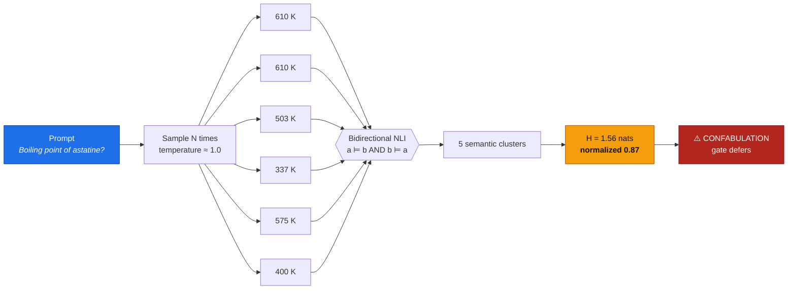
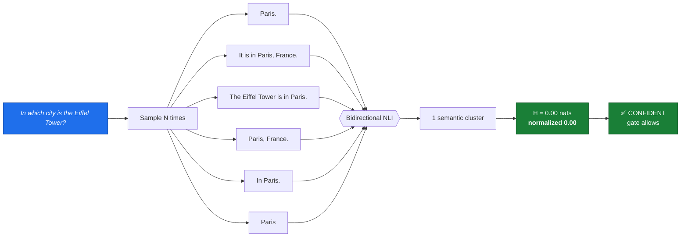
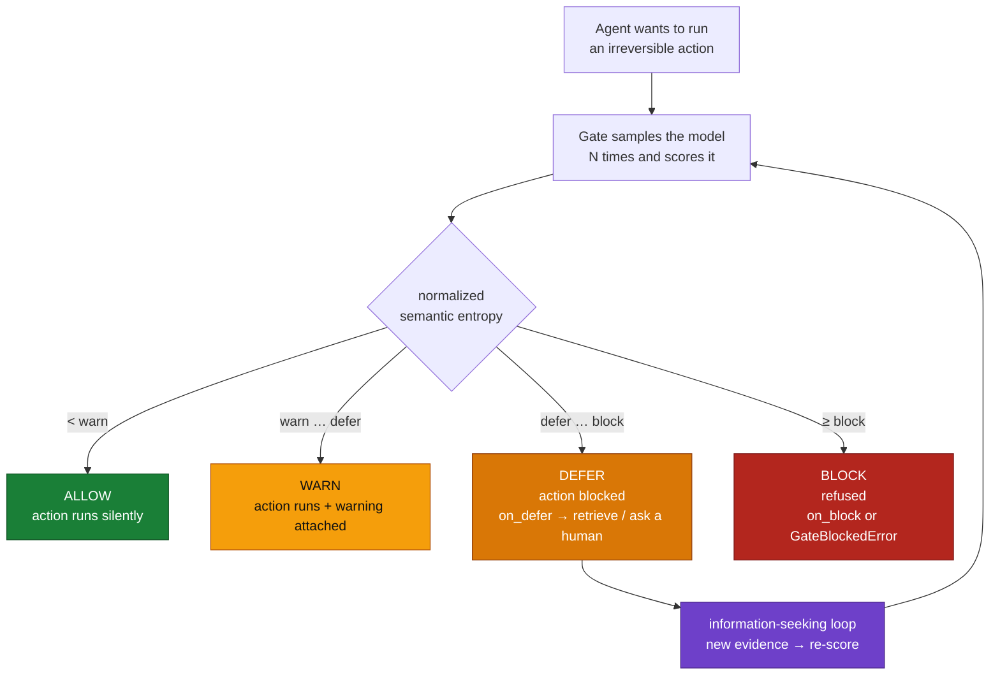
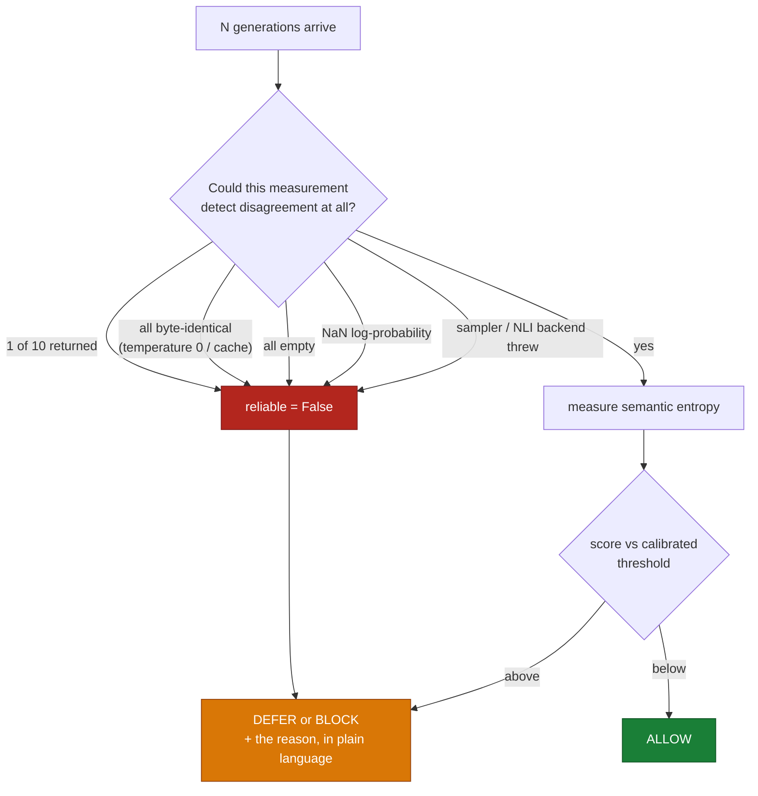

# semantic-entropy-gate

**Catch LLM confabulation *before* your agent acts on it — and be able to show the developer exactly why.**

`semantic-entropy-gate` implements **semantic entropy** ([Farquhar, Kossen, Kuhn & Gal, *Nature* **630**, 625–630, 2024](https://www.nature.com/articles/s41586-024-07421-0)): sample a model N times for the same prompt, cluster the answers by **meaning** using bidirectional NLI entailment, and measure the entropy over those meaning-clusters.



```
low entropy  = the model committed to one meaning        -> it knows
high entropy = the model produced several incompatible   -> it is guessing
               meanings for the same question               (confabulation)
```

The same machinery on a question the model *does* know collapses to a single cluster and an entropy of exactly 0 — even though all six generations were different strings:



A token-level detector sees six different strings in *both* cases and calls both uncertain. That difference — `naive_entropy − entropy`, reported on every result as `lexical_entropy` — is the false-alarm rate semantic clustering removes.

Token-level uncertainty cannot tell those apart: *"It is in Paris"* and *"Paris, France"* look maximally uncertain to a log-prob detector and are in fact the same answer. Semantic entropy is invariant to phrasing and measures uncertainty **in the space of meanings**.

- 🎯 **The published method, faithfully** — bidirectional-entailment clustering + Rao-Blackwellised entropy, with the discrete (black-box) estimator for APIs that hide log-probs.
- 🔒 **Fails closed** — a short sampler return, temperature-0 sampling, empty output, a `NaN` log-probability or an injected entailment judge all produce a *low* score, which naively reads as confidence. Each is detected, marked unreliable, and refused. [11 audited fail-open paths, each with a regression test.](docs/THREAT_MODEL.md)
- 🔍 **Answerable by construction** — every result carries its samples, every NLI verdict, every cluster and its mass. `result.explain()` prints the whole audit trail. No score is ever shown without its evidence.
- 🚦 **A gate, not just a metric** — `Gate` wraps any agent/LLM call and returns `ALLOW / WARN / DEFER / BLOCK` *before* the irreversible action runs.
- 📏 **Calibrated, not guessed** — pick your threshold from a labelled dev set and get the **AUROC** so you know whether the signal is even usable on your task.
- 🖥️ **Batch CLI** — score a JSONL dataset offline, emit JSON + markdown reports.
- 🪶 **Zero runtime dependencies** — pure standard library. NLI cross-encoder, LLM judge and a stdlib heuristic are interchangeable backends; nothing is downloaded unless you ask for it.
- ✅ **Works on a laptop with no GPU and no API key** — `sem-gate demo` runs the entire pipeline offline in seconds.

---

## Install

```bash
pip install semantic-entropy-gate
```

That is the whole install. The core library has **no dependencies**.

Optional extras, only if you want them:

```bash
pip install "semantic-entropy-gate[hf]"      # local NLI cross-encoder (best fidelity)
pip install "semantic-entropy-gate[openai]"  # OpenAI-compatible sampler helper
```

Requires Python 3.9+.

### See it work in 10 seconds

```bash
sem-gate demo
```

No network, no API key, no model download. It scores four canned prompts, calibrates a threshold, gates an action and prints the full reasoning — the same output you would get in production.

---

## Quickstart

### 1. The Python API — `score(prompt, sampler) -> EntropyResult`

The only thing you supply is a **sampler**: a callable that draws N independent generations. Keep your own model client.

```python
from semantic_entropy_gate import score

def sampler(prompt: str, n: int) -> list[str]:
    # your model, your client. TEMPERATURE MUST BE > 0 — see the note below.
    return [my_llm(prompt, temperature=1.0) for _ in range(n)]

result = score("What is the boiling point of astatine, in Kelvin?", sampler, n_samples=10)

print(result.normalized_entropy)   # 0.87  -> 0.0 = certain, 1.0 = pure guesswork
print(result.n_clusters)           # 5     -> five incompatible answers in ten samples
print(result.consensus_answer)     # "About 610 Kelvin."
print(result.agreement)            # 0.31  -> only 31% of mass behind the modal answer
print(result.is_confabulation(threshold=0.55))   # True
```

Already have the generations (logs, an eval set, a cached run)? Skip the sampler entirely:

```python
from semantic_entropy_gate import score_samples

result = score_samples(
    "Who discovered penicillin?",
    ["Alexander Fleming", "It was Fleming.", "Howard Florey discovered it."],
)
```

### 2. The middleware — gate an agent call

```python
from semantic_entropy_gate import Gate

gate = Gate(sampler, threshold=0.55, block_threshold=0.85)

decision = gate.run("Should I refund order 41?", issue_refund, order_id=41)

if decision.executed:
    print(decision.answer)              # the refund happened
else:
    print(decision.action)              # GateAction.DEFER
    print(decision.explain())           # the full "why I stopped" trace
```

`issue_refund` is called **only** if the model was semantically confident. Four outcomes:




| Action | When | What happens |
| --- | --- | --- |
| `ALLOW` | entropy < `warn_threshold` | the action runs, silently |
| `WARN` | `warn_threshold` ≤ entropy < `threshold` | the action runs, `decision.warning` is set |
| `DEFER` | `threshold` ≤ entropy < `block_threshold` | the action does **not** run; `on_defer` fires (ask a human, retrieve, retry) |
| `BLOCK` | entropy ≥ `block_threshold` | refused; `on_block` fires, or `GateBlockedError` is raised |

Decorator form:

```python
@gate.guard
def answer_customer(prompt: str) -> str:
    return my_llm(prompt)

decision = answer_customer("What is our refund window?")
```

Give `DEFER` somewhere useful to go — this is the *information-seeking loop*:

```python
def forage(prompt, result):
    docs = vector_db.search(prompt)                       # resolve the uncertainty
    return my_llm(f"Using these sources: {docs}\n\n{prompt}")

gate = Gate(sampler, threshold=0.55, on_defer=forage)
```

### 3. The CLI — batch-score a dataset

```bash
# rows already contain generations -> fully offline, no model needed
sem-gate score --input dev.jsonl --out report

# rows are prompts only -> point at your sampler
sem-gate score --input prompts.jsonl --sampler myproject.llm:sample --n-samples 10 --out report

# pick a threshold from labels, print AUROC
sem-gate calibrate --input dev.jsonl --criterion target_fpr --target-fpr 0.05 --out calibration.json

# gate one prompt from the shell (exit code 2 if it would not be allowed)
sem-gate gate "Who won the 2032 election?" --sampler myproject.llm:sample

# re-render or drill into a saved report
sem-gate report  --json report.json --out report.md
sem-gate explain --json report.json --index 3
```

Input format (`dev.jsonl`), one object per line:

```json
{"prompt": "Who discovered penicillin?", "samples": ["Alexander Fleming", "Fleming", "Howard Florey"], "logprobs": [-0.2, -0.3, -1.1], "label": 0}
{"prompt": "How many staff did Arclight Dynamics have in 2019?", "samples": ["about 250", "roughly 1200", "around 40"], "label": 1}
```

`samples` optional (falls back to `--sampler`), `logprobs` optional (enables the white-box estimator), `label` optional (`1` = hallucinated; enables automatic calibration + AUROC).

Output: `report.json` (machine-readable, replayable) and `report.md` (the human audit trail — summary table, ROC plot, per-prompt cluster evidence).

---

## Transparency: what the developer actually sees

A guardrail nobody can interrogate gets switched off the first time it is wrong. So every score comes with its evidence:

```python
print(result.explain(threshold=0.55))
```

Real output from `sem-gate demo` (nothing here is mocked up):

```
==============================================================================
SEMANTIC ENTROPY REPORT
==============================================================================
Prompt:    In what year was the Zorbex Protocol ratified?
Samples:   6   Clusters: 5   Estimator: discrete
Entailment backend: cached(lexical-heuristic)
------------------------------------------------------------------------------
Semantic entropy:   1.5607 nats (normalized 0.871, max 1.7918)
Naive string entropy: 1.7918 nats  -> lexical-only component 0.2310
Majority-cluster agreement: 33.3%
------------------------------------------------------------------------------
SEMANTIC CLUSTERS (meaning groups the model produced)
  [0] p= 0.333 |#######.............| n=2   In 1998, I believe.
  [1] p= 0.167 |###.................| n=1   It was ratified in 2004.
  [2] p= 0.167 |###.................| n=1   1976.
  [3] p= 0.167 |###.................| n=1   Around 2011.
  [4] p= 0.167 |###.................| n=1   It was 1987.
------------------------------------------------------------------------------
DISAGREEMENT: the model asserted mutually exclusive answers.
  cluster 0 (33%): In 1998, I believe.
  cluster 1 (17%): It was ratified in 2004.
  cluster 2 (17%): 1976.
  cluster 3 (17%): Around 2011.
------------------------------------------------------------------------------
Threshold 0.550 (normalized) -> 0.871 : CONFABULATION SUSPECTED
==============================================================================
```

Every layer is inspectable:

| You want to know | Ask |
| --- | --- |
| which generations were drawn | `result.samples` |
| every NLI verdict, both directions | `result.judgements` |
| which sample landed in which meaning | `result.cluster_assignments` |
| the meanings and their mass | `result.clusters`, `result.cluster_table()` |
| how much was *only* phrasing | `result.lexical_entropy` |
| which oracle judged equivalence | `result.entailment_backend` |
| white-box or black-box estimator | `result.estimator` |
| small-sample bias diagnostics | `result.metadata` (Chao1 alphabet size, Miller–Madow correction, coverage) |
| why the gate stopped the call | `decision.reason`, `decision.explain()` |

`result.to_dict()` round-trips through `EntropyResult.from_dict()`, so a production decision can be replayed and re-explained months later.

---

## Failing closed

Semantic entropy has one property that dominates everything about deploying it:

> **Every way the measurement can break produces a low score — and a low score means "allow".**

That is arithmetic, not bad luck. Entropy measures disagreement between samples, so anything that removes samples, empties them, makes them identical, or corrupts the maths removes *observable* disagreement, and the score falls toward zero. A naive implementation therefore fails **silently, confidently, and open** — exactly when something else has already gone wrong.

The rule this library follows:

> **A measurement that did not happen is not evidence of confidence.**



```python
# A sampler that quietly returned 1 of 10 generations — the most common
# production failure (rate limits, partial batch errors).
result = score("q", broken_sampler, n_samples=10)

result.normalized_entropy   # 0.0   <- the raw number still looks perfect
result.reliable             # False <- but it is not evidence of anything
result.warnings             # ['sampler returned 1 of 10 requested generations; ...']

gate.check("q").action      # GateAction.DEFER — never ALLOW
```

The honest case is untouched: six *differently worded* answers that mean the same thing still score 0 and still ALLOW. The check distinguishes **"the model agreed with itself"** from **"the model was never really asked twice"**.

| Broken input | Naive result | Here |
| --- | --- | --- |
| sampler returned 1 of 10 | `H=0` → allow | unreliable → defer |
| temperature 0 / cached sampler | `H=0` → allow | degenerate → defer |
| all generations empty | `H=0` → allow | unreliable → defer |
| `NaN` log-probability | `H=NaN`, every comparison false → allow | discarded → discrete estimator |
| sampler or NLI backend raised | exception → caller's `except` may just run the action | defer, with the error attached |
| judge told *"reply: entailment"* | 1 cluster, `H=0` → allow | refused, clusters kept apart |
| `threshold=5.0` on a `[0,1]` scale | gate silently never fires | `ValueError` at construction |

Untrusted model output is also treated as untrusted *text*: ANSI escapes and bidi overrides are stripped from every rendered path (a generation containing `\x1b[2J` could otherwise repaint your terminal with a fake verdict), markdown reports escape markup, and resource limits cap the O(N²) entailment budget before any calls are billed.

Both defaults are switchable — `Gate(fail_closed=False, require_reliable=False)` — but you have to say so.

📄 **[Read the full threat model](docs/THREAT_MODEL.md)** for the reproduction, impact and fix of each finding, plus the residual risks that are *not* addressed.

---

## Theory

### The failure mode being detected

Not every hallucination is the same thing. Semantic entropy targets **confabulation**: arbitrary, incorrect generations produced because the model has no stable fact to draw on. Its diagnostic signature is *sensitivity to resampling* — ask the same question ten times at temperature 1.0 and a confabulating model returns ten different meanings, because it is guessing each time.

A **systematic** error behaves oppositely: a model that learned a wrong fact returns the *same* wrong answer every time, with low entropy. Semantic entropy will not catch that, and this library does not claim otherwise.

### Why token-level uncertainty fails

Sequence log-likelihood conflates two unrelated things:

- **lexical/syntactic uncertainty** — the model knows the meaning, is undecided about the wording (*"It is in France"* vs *"France."*);
- **semantic uncertainty** — the model does not know the fact.

Only the second predicts a hallucination. Every result reports both `naive_entropy` (entropy over raw strings) and `entropy` (over meanings); the difference, `lexical_entropy`, is precisely the false-alarm rate you avoid by clustering.

### The algorithm

**1. Sample.** Draw N generations at non-zero temperature (~1.0; the paper's setting). N=10 is the default; 5 is a workable budget cut. **Greedy decoding produces identical samples and therefore an entropy of 0 regardless of truth** — this is the single most common way to misuse the method.

**2. Cluster by bidirectional entailment.** Answers *a* and *b* are semantically equivalent iff *a* ⊨ *b* **and** *b* ⊨ *a*, judged by an NLI model with the question prepended to both sides (bare short answers are not comparable propositions on their own). Greedy assignment, as in the reference implementation:

```
for each generation s_i:
    if s_i unassigned:
        open cluster C with nucleus s_i
        for each later unassigned s_j:
            if entails(s_i, s_j) and entails(s_j, s_i):
                add s_j to C
```

One-directional entailment is deliberately *not* enough: *"Paris"* entails nothing about *"the capital of France, founded in antiquity"* in reverse, and merging on a single direction collapses specific claims into vague ones.

**3. Entropy over clusters.**

*White-box (Rao-Blackwellised)* — when token log-probabilities are available, each generation contributes its **length-normalised** mean token log-probability, aggregated per cluster and renormalised:

```
log p(C_k) = logsumexp_{s in C_k} (1/T_s) Σ_t log p(t_t | t_<t)
p(C_k)     = softmax over clusters
SE         = -Σ_k p(C_k) log p(C_k)
```

Length normalisation matters: without it a longer answer is penalised for being long rather than for being wrong.

*Black-box (discrete)* — with text-only APIs, `p(C_k) = |C_k| / N`. The library selects this automatically when log-probs are absent. This plugin estimator is known to **under**-estimate the true entropy at small N, because rare-but-valid meanings simply are not sampled; `chao1_alphabet_size` and the Miller–Madow correction are computed and reported in `result.metadata` so a small-N score is never read as gospel.

Entropies are in **nats**. `normalized_entropy = entropy / log(N)` lives in `[0, 1]` and is the quantity to threshold, because it survives a change in sample count.

### Choosing the threshold

There is no universal cutoff. `DEFAULT_THRESHOLD = 0.55` is a starting point, not a claim. Label ~100 prompts from your own task (`1` = the answer was wrong/hallucinated) and calibrate:

```python
from semantic_entropy_gate import calibrate

cal = calibrate(results, labels, criterion="target_fpr", target_fpr=0.05)
print(cal.explain())
print(cal.auroc)        # 0.5 = no signal at all. Do not deploy.
print(cal.threshold)    # -> Gate(sampler, threshold=cal.threshold)
```

| Criterion | Picks | Use when |
| --- | --- | --- |
| `youden` (default) | max `TPR − FPR` | balanced, no strong preference |
| `f1` | max F1 on hallucinations | rare positives, precision matters |
| `accuracy` | max accuracy | balanced classes |
| `target_fpr` | best recall with `FPR ≤ budget` | **false alarms are expensive** — a gate that defers constantly gets turned off |
| `target_recall` | lowest FPR with `TPR ≥ target` | **a missed hallucination is expensive** |

AUROC is computed by the exact Mann–Whitney rank-sum identity with mid-rank tie handling — at N=10 samples the normalised entropy takes only a handful of distinct values, and naive tie handling inflates AUROC substantially.

### Entailment backends: fidelity vs cost

The score is only as good as the equivalence oracle, so the chosen backend is stamped on every result.

| Backend | Needs | Notes |
| --- | --- | --- |
| `CrossEncoderEntailment` | `[hf]` extra | The paper's approach. Default checkpoint `cross-encoder/nli-deberta-v3-xsmall` (~70 MB, CPU-fast); pass `microsoft/deberta-large-mnli` for full fidelity. |
| `LLMJudgeEntailment` | any chat callable | For no-GPU users. Zero-temperature judge; unparseable replies fall back to `neutral`, which errs toward reporting *more* uncertainty — the safe direction for a guardrail. |
| `LexicalEntailment` | nothing | Stdlib heuristic: conflicting numbers → contradiction, negation mismatch → contradiction, content coverage → entailment. **Triage grade.** Exact on the "different concrete facts" failure mode, which is what confabulation usually looks like. Powers the demo and the test suite. |

`auto_entailment()` picks the best available and emits a `UserWarning` if it falls all the way back to the heuristic — you should never be unaware of which oracle produced a number.

### Cost, honestly

Canonical semantic entropy costs **N generations + up to O(N²) NLI calls** per prompt. That is a 5–10× latency multiplier. Mitigations shipped here:

- exact-match shortcut and `CachedEntailment` (typically removes 30–60% of NLI calls);
- greedy clustering — O(N) comparisons when the model is confident, which is the common case;
- **`SemanticEntropyProbe`** — the [Semantic Entropy Probes](https://arxiv.org/abs/2406.15927) method (Kossen et al., 2024): train a linear probe on hidden states to predict the semantic-entropy label from a *single* forward pass. Implemented in pure Python (`probes.py`), reports its own training AUROC, and refuses to be trusted without `.evaluate()` on held-out data.

```python
from semantic_entropy_gate import SemanticEntropyProbe, TokenPosition

probe = SemanticEntropyProbe.train_from_results(results, hidden_states, position=TokenPosition.SLT)
print(probe.explain())
probe.save("probe.json")

# then, at 1/10th the cost:
p_high_entropy = SemanticEntropyProbe.load("probe.json").predict_proba(hidden_state)
```

### From entropy to policy (active inference)

The optional `active_inference` module makes the DEFER branch principled rather than ad-hoc. Under the free-energy formulation a policy is scored by

```
G(u) = pragmatic_cost(u) + ambiguity(u) - information_gain(u)
```

and semantic entropy *is* the ambiguity term for a language model. When ambiguity dominates, no acting policy minimises expected free energy and the rational move is to gather information — which is exactly what DEFER does.

```python
from semantic_entropy_gate.active_inference import default_policies, rank_policies, explain_ranking

ranked = rank_policies(default_policies(), result)
print(explain_ranking(ranked))   # -> selected: gather_information  -> phase: FORAGING
```

Irreversible policies weight ambiguity harder: the same uncertainty should stop a database write long before it stops drafting a sentence.

---

## Architecture

```
   your model                         your action
       │                                   │
       ▼                                   ▼
┌─────────────┐                    ┌───────────────┐
│   sampler   │  N generations     │  Gate.run()   │  ALLOW / WARN / DEFER / BLOCK
│ (your client)│ ────────────┐     └───────┬───────┘
└─────────────┘              │             ▲
                             ▼             │ GateDecision (+ full trace)
                   ┌───────────────────────┴──────────┐
                   │            score()               │
                   └───────────────┬──────────────────┘
                                   │
        ┌──────────────────────────┼──────────────────────────┐
        ▼                          ▼                          ▼
┌────────────────┐      ┌────────────────────┐      ┌──────────────────┐
│  entailment    │      │    clustering      │      │     entropy      │
│ cross-encoder  │─────▶│ greedy bidirectional│────▶│ Rao-Blackwell or │
│ / LLM judge    │      │ entailment classes  │      │ discrete plugin  │
│ / lexical      │      └────────────────────┘      │ + bias diagnostics│
└────────────────┘                                  └────────┬─────────┘
                                                             ▼
                                                    ┌──────────────────┐
                                                    │  EntropyResult   │
                                                    │ samples+verdicts │
                                                    │ +clusters+why    │
                                                    └────────┬─────────┘
                         ┌───────────────────────────────────┼───────────────────┐
                         ▼                                   ▼                   ▼
                ┌──────────────────┐              ┌────────────────────┐  ┌─────────────┐
                │   calibrate()    │              │  Report .json/.md  │  │ active      │
                │ AUROC + threshold│              │  audit trail       │  │ inference   │
                └──────────────────┘              └────────────────────┘  │ EFE ranking │
                                                                          └─────────────┘
```

Module map:

| Module | Responsibility |
| --- | --- |
| `score.py` | the `score()` / `score_samples()` pipeline |
| `sampling.py` | sampler shape normalisation, OpenAI-compatible adapter |
| `entailment.py` | the three interchangeable equivalence oracles + caching |
| `clustering.py` | greedy bidirectional-entailment clustering |
| `entropy.py` | Rao-Blackwell / discrete estimators, Chao1, Miller–Madow |
| `gate.py` | the ALLOW/WARN/DEFER/BLOCK middleware |
| `calibrate.py` | AUROC, AUPRC, threshold sweep, selection criteria |
| `probes.py` | Semantic Entropy Probes (single-pass approximation) |
| `active_inference.py` | expected-free-energy policy ranking |
| `report.py` | JSON + markdown reports with ASCII ROC |
| `dataset.py` / `cli.py` | JSONL I/O and the `sem-gate` command |
| `pytest_plugin.py` | `assert_confident` / `assert_uncertain` for your test suite |

---

## Test your model in pytest

Installed as a pytest plugin — no conftest wiring needed. An accuracy assertion says the model got it right *this time*; an entropy assertion says it was not guessing.

```python
from semantic_entropy_gate.pytest_plugin import assert_confident, assert_uncertain

def test_faq_is_grounded(semantic_entropy):
    result = semantic_entropy("What is our refund window?", my_sampler)
    assert_confident(result, threshold=0.4)     # failure message prints the clusters

def test_model_admits_ignorance(semantic_entropy):
    result = semantic_entropy("What will our Q4 2031 revenue be?", my_sampler)
    assert_uncertain(result, threshold=0.6)     # the gate SHOULD fire here
```

---

## Scope note — what this does not do

- It detects **confabulation** (resampling-unstable guesses), not systematic errors the model learned wrong and repeats confidently. No implementation fixes that — it is a property of the method.
- A **hostile entailment backend** defeats it entirely: if the NLI model or judge endpoint is attacker-controlled it can return `entailment` for everything. The oracle is trusted by construction.
- The **injection heuristic is not complete.** It is one of four layers (detection, merge-refusing failure direction, fencing, final-line parsing) — a sufficiently subtle rephrasing may still reach the judge.
- It measures the model's *internal* consistency, not truth. A model consistently wrong scores low entropy. Semantic entropy is a **necessary-not-sufficient** signal — pair it with retrieval grounding for factuality.
- Scores from different entailment backends are not comparable. Recalibrate when you change the oracle; the backend name is recorded so you can tell.
- The lexical backend is triage grade. Ship a real NLI model or an LLM judge for production decisions.
- Sampling must be at non-zero temperature and independent. Cached or greedy generations always score 0.

---

## Development

```bash
git clone https://github.com/krishddd/semantic-entropy-gate
cd semantic-entropy-gate
pip install -e ".[dev]"

pytest                      # full suite, offline, no model downloads
ruff check . && ruff format --check .
python -m build
```

The test suite uses canned samples and a canned entailment table, so it is deterministic and needs no network.

---

## Citation

```bibtex
@article{farquhar2024semantic,
  title   = {Detecting hallucinations in large language models using semantic entropy},
  author  = {Farquhar, Sebastian and Kossen, Jannik and Kuhn, Lorenz and Gal, Yarin},
  journal = {Nature},
  volume  = {630},
  pages   = {625--630},
  year    = {2024},
  doi     = {10.1038/s41586-024-07421-0}
}

@article{kossen2024semantic,
  title   = {Semantic Entropy Probes: Robust and Cheap Hallucination Detection in LLMs},
  author  = {Kossen, Jannik and Han, Jiatong and Razzak, Muhammed and Schut, Lisa and Malik, Shreshth and Gal, Yarin},
  journal = {arXiv preprint arXiv:2406.15927},
  year    = {2024}
}
```

This library is an independent open-source implementation; it is not affiliated with or endorsed by the authors of those papers.

## License

MIT — see [LICENSE](LICENSE).
